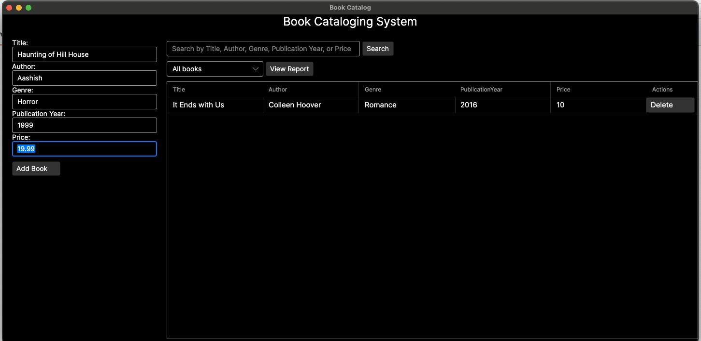
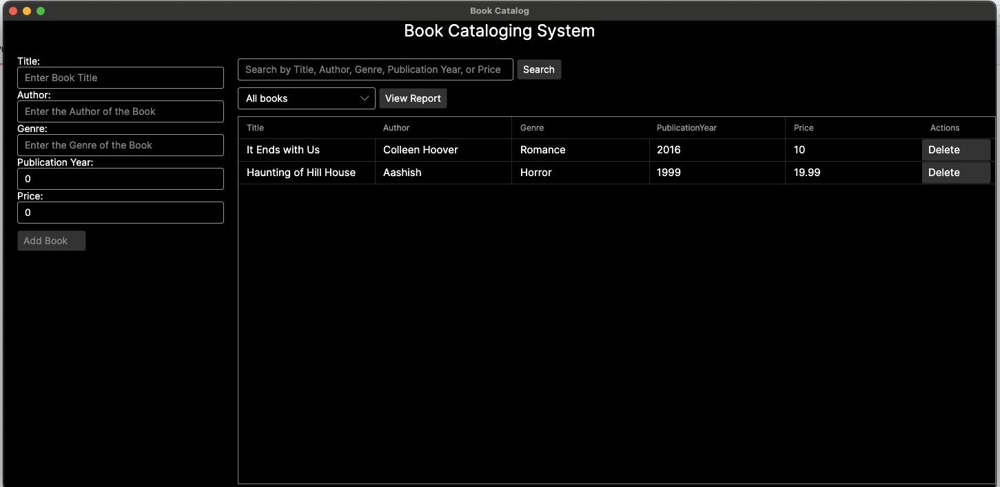
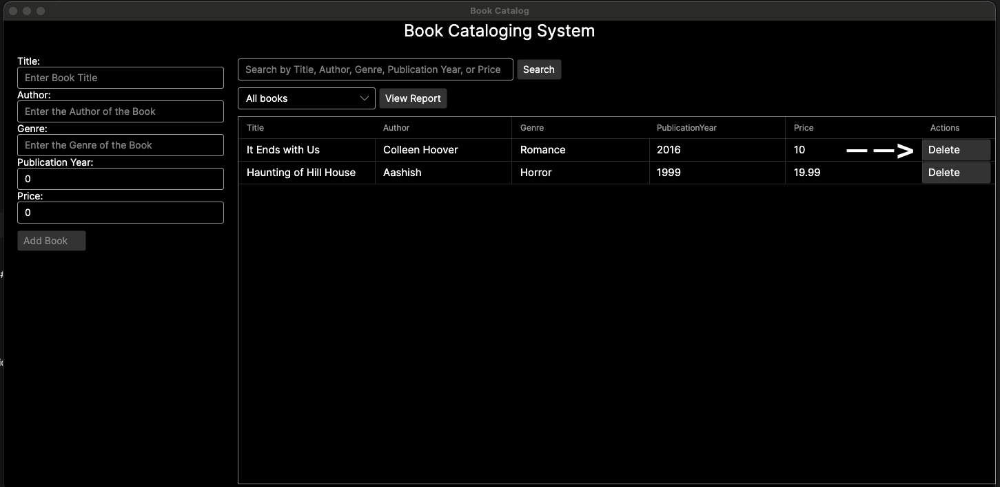
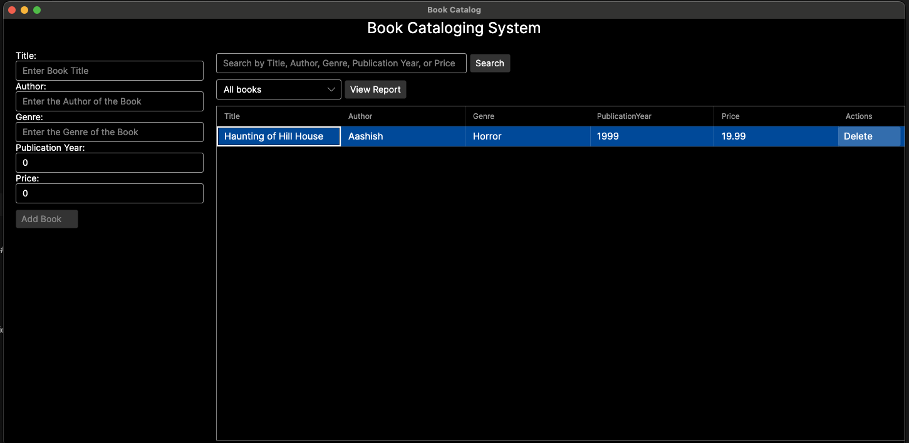
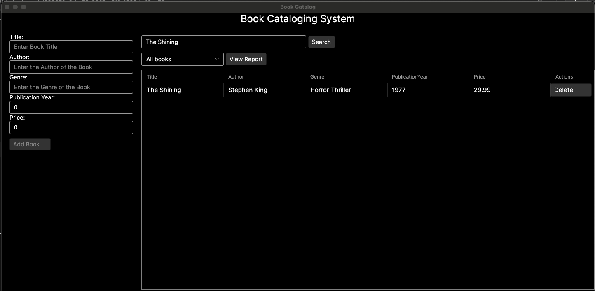
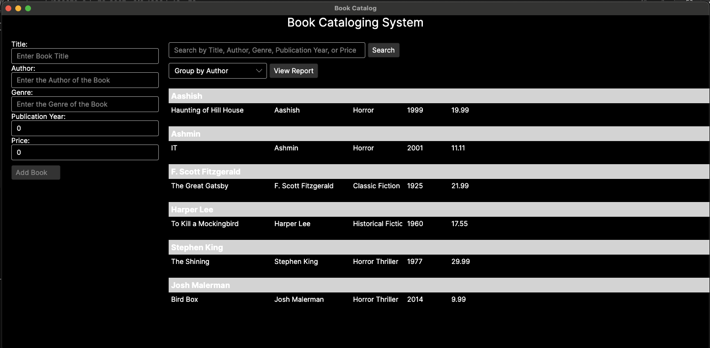
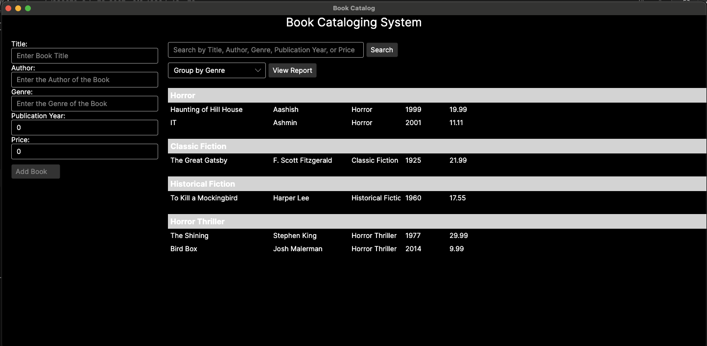

# 📚 Book Cataloging System (C# + AvaloniaUI)

A simple desktop book cataloging system built with **C#**, **.NET**, and **[AvaloniaUI](https://avaloniaui.net/)**. It allows users to add, delete, search, and group books by genre or author with a reactive, modern desktop interface.

## 📦 Project Structure

```text
.
├── App.axaml
├── App.axaml.cs
├── app.manifest
├── csharp.csproj
├── MainWindow.axaml
├── MainWindow.axaml.cs
├── Models
│   ├── Book.cs
│   └── BookGroup.cs
├── Program.cs
├── README.md
├── Services
│   └── CatalogService.cs
└── ViewModels
    └── MainWindowViewModel.cs
```

## 🛠️ Setup Instructions

### 📌 Requirements

- [.NET SDK 6.0+](https://dotnet.microsoft.com/en-us/download)
- [Visual Studio 2022+](https://visualstudio.microsoft.com/) or [Visual Studio Code](https://code.visualstudio.com/)

### 📥 Restore Dependencies

1️⃣ Navigate to the `csharp` project directory, run:

```bash
dotnet restore
```

## 🚀 Run the Application

From the `csharp/` directory:

```bash
dotnet run
```

## 📚 Features

- Add new books to the catalog (title, author, genre, publication year, price)
- Remove existing books
- Search for books by title, author, genre or price
- View simple reports of books grouped by genre or author

## 🎉 Acknowledgements

This project wouldn’t have been possible without the fantastic [AvaloniaUI](https://avaloniaui.net/). Huge thanks to the maintainers and community for their brilliant work, examples, and documentation!

## 📺 Simple Demo

### 📖 Add a Book

1️⃣ Enter book details like **Title**, **Author**, **Genre**, **Publication Year**, and **Price**.



2️⃣ Click the **"Add Book"** button.

3️⃣ The new book will appear in the catalog list.



---

### 🗑️ Delete a Book

1️⃣ Locate the book you want to delete in the catalog table. Each entry has an `Action` column with a `Delete` button.



2️⃣ Click the **"Delete"** button corresponding to that book.  
3️⃣ The book will be removed from the catalog immediately.



---

### 🔍 Search for Books

1️⃣ Enter a search term in the `Search` box. You can search by `Title`, `Author`, `Genre`, `Publication Year`, or `Price`.

2️⃣ Click the Search button to filter the catalog.

3️⃣ The catalog will instantly update to show only the matching books.



---

### 📊 View Reports (Optional)

1️⃣ Use the dropdown menu to switch the report type from `All Books` to `Group by Author`, then click `View Report`.



2️⃣ Similarly, you can select `Group by Genre` from the dropdown and click `View Report` to see the catalog grouped by genre.


