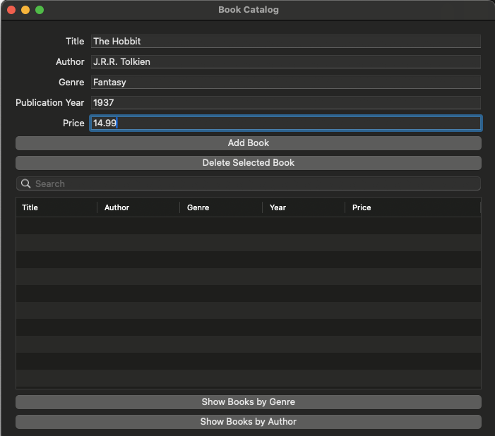
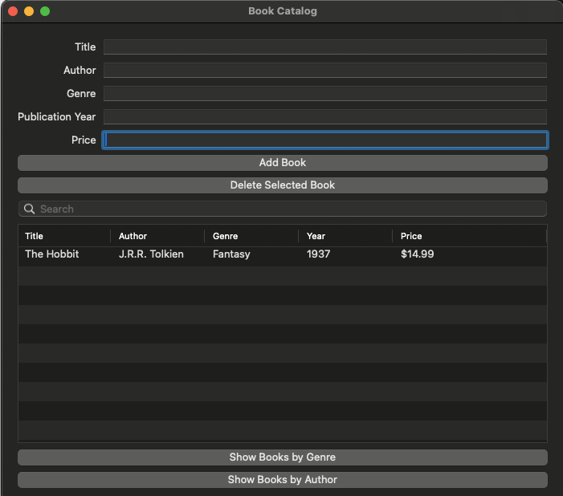
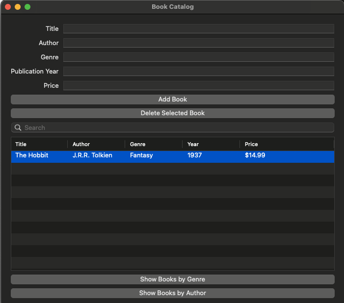
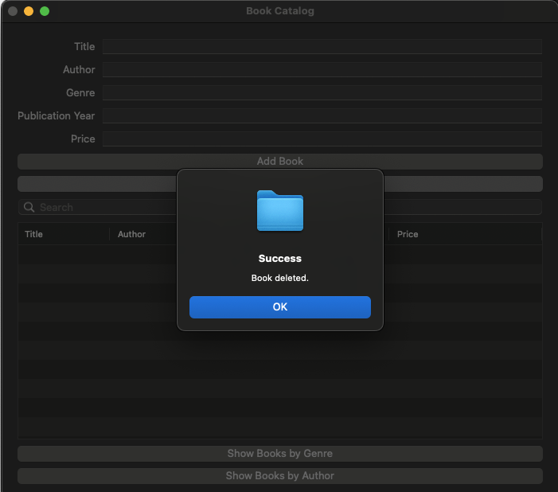
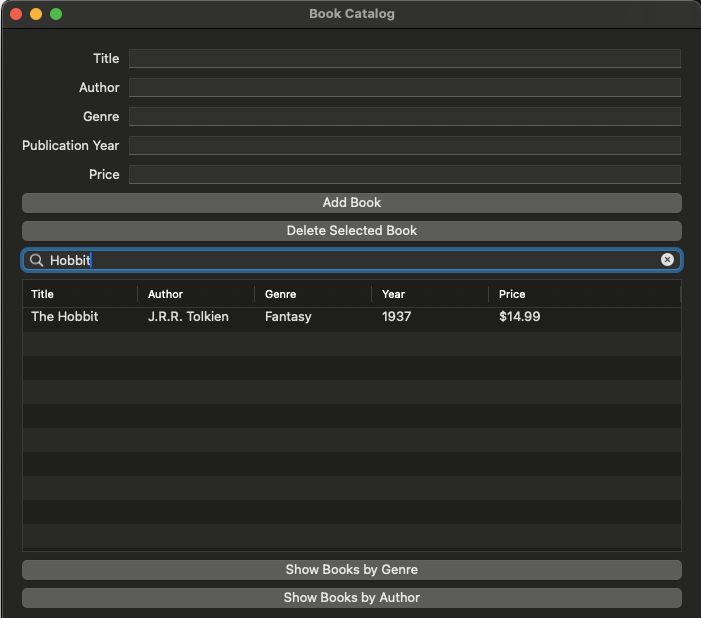
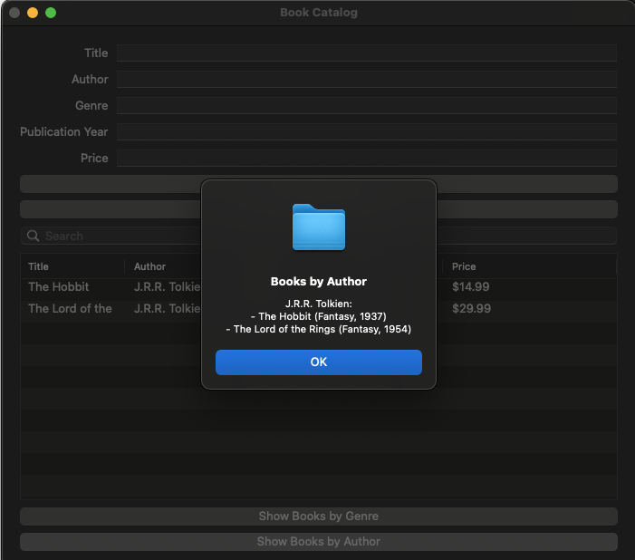
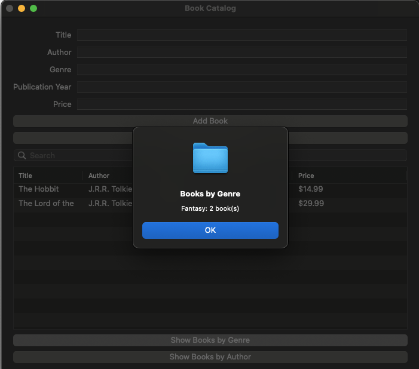

# 📚 Book Cataloging System (Ruby + Glimmer DSL for LibUI)

[](https://www.ruby-lang.org/en/)
[](https://rspec.info/)
[](https://github.com/AndyObtiva/glimmer-dsl-libui)

A simple GUI-based desktop application for managing a catalog of books built with Ruby and the excellent [Glimmer DSL for LibUI](https://github.com/AndyObtiva/glimmer-dsl-libui).

## 📖 Table of Contents

- [Project Structure](#-project-structure)
- [Setup Instructions](#️-setup-instructions)
- [Run the Application](#-run-the-application)
- [Testing](#testing)
- [Features](#features)
- [Acknowledgements](#-acknowledgements)
- [Simple Demo](#-simple-demo)

## 📦 Project Structure

```text
.
├── Gemfile
├── Gemfile.lock
├── main.rb
├── models
│   └── book.rb               # Book Struct (data model)
├── services
│   ├── book_catalog_ui.rb    # Catalog UI controller logic
│   └── catalog.rb            # Catalog service logic
├── ui
│   └── book_catalog_window.rb # GUI window definition
└── README.md
```

## 🛠️ Setup Instructions

### 📌 Requirements

- Ruby (3.0+ recommended)
- Bundler (for managing dependencies — typically comes with modern Ruby)

### 📥 Install Dependencies

1️⃣ Install Bundler if you haven't yet:

```bash
gem install bundler
```

2️⃣ Navigate to the `ruby` project directory and install the required gems:

```bash
bundle install
```

## 🚀 Run the Application

From the `ruby/` directory:

```bash
ruby main.rb
```

## Testing

This project uses [RSpec](https://rspec.info/) for unit testing key functionalities of the BookCatalogUI class and its supporting services.

### Test Coverage Includes:

- Adding new books to the catalog
- Deleting books from the catalog
- Refreshing and filtering table data
- Generating reports grouped by genre and author
- Validation scenarios for required fields, invalid input values, and duplicate entries
- Edge cases such as empty inputs, empty catalogs, and search queries with no results

### 📌 Run the Tests:

From the `ruby/` directory:

```bash
bundle exec rspec tests
```

Test results will be displayed in the terminal, showing passed and failed cases with detailed messages for easy debugging.

## 📚 Features

- Add new books to the catalog (title, author, genre, publication year, price)
- Remove existing books
- Search for books by title, author, genre or price
- View simple reports of books grouped by genre or author

## 🎉 Acknowledgements

This project wouldn’t have been possible without the fantastic [Glimmer DSL for LibUI (v0.12.8)](https://github.com/AndyObtiva/glimmer-dsl-libui). Huge thanks to the maintainers and community for their brilliant work, examples, and documentation!

## 📺 Simple Demo

### 📖 Add a Book

1️⃣ Enter book details like **Title**, **Author**, **Genre**, **Publication Year**, and **Price**.



2️⃣ Click the **"Add Book"** button.

3️⃣ The new book will appear in the catalog list.



---

### 🗑️ Delete a Book

1️⃣ Select a book from the catalog list.



2️⃣ Click **"Delete Selected Book"**.  
3️⃣ The book will be removed from the catalog.



---

### 🔍 Search for Books

1️⃣ Enter a search term in the **Search** box (by Title, Author, Genre, Publication Year or Price).

2️⃣ Matching books will instantly be filtered in the catalog list.



---

### 📊 View Reports (Optional)

1️⃣ Click Show Books by Author to see a summary grouped by author.



2️⃣ Click Show Books by Genre to see a summary grouped by genre.


